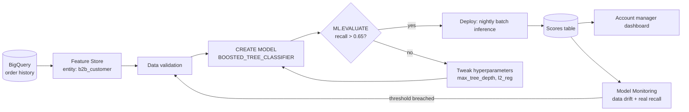
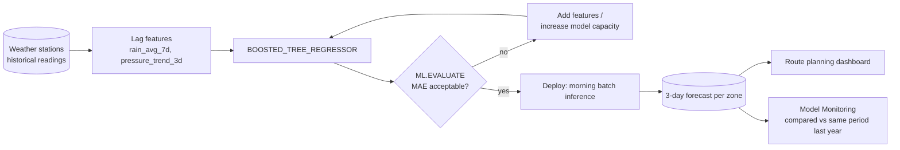
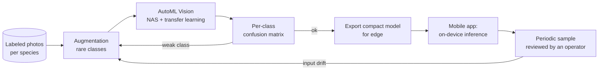
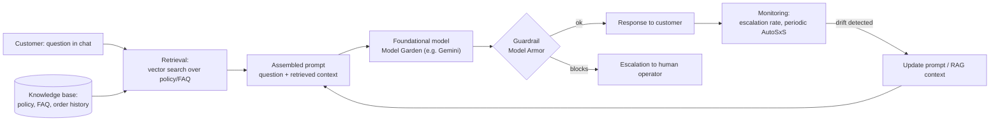

# PMLE Certification — Synthesis: end-to-end architectures and MLOps

!!! warning "This lesson isn't an exam domain — it's a synthesis"
    The six previous lessons are mapped 1:1 onto the exam guide's six
    official domains, with content verified word-for-word wherever
    possible. This lesson is different: it was added at the learner's
    explicit request to **connect** that theory into complete, concrete
    architectures, because real exam questions are often based on
    scenarios that span multiple domains at once, not a single isolated
    domain. There's no verbatim exam guide text to cite for these four
    architectures: they're teaching syntheses built by applying concepts
    already covered (and flagged `needs_reverification`) in previous
    lessons. Every Google Cloud product name used here has already been
    verified in the corresponding domain lessons; it isn't re-verified a
    second time here. The diagrams and the reference to the Google Cloud
    Architecture Framework's pillars are likewise a teaching synthesis,
    not verbatim text from that framework.

## Four architectures, four different problems

Not a single example stretched out endlessly, but four realistic
problems that together cover the most common data types, serving
patterns, and decisions: tabular data for an internal business decision
(purchase prediction, batch), time series with external features
(weather forecasting, batch), images with a team that has no ML skills
(flower classification with AutoML, edge), and a generative AI
application (customer support assistant with RAG, online) — the only one
of the four in real time, deliberately chosen to show a different
serving pattern from the other three. For each: data and features, model
choice, training and troubleshooting, pipeline, deployment, monitoring —
the same seven questions a real ML project has to answer in one order or
another.

!!! info "How to read the diagrams: the Google Cloud Architecture Framework"
    Each architecture below includes a diagram and a brief reference to
    which **pillars** of the Google Cloud Architecture Framework (Google
    Cloud's "Well-Architected Framework") the described decision applies
    — not to introduce new concepts, but to put an explicit name to
    reasoning already done in previous lessons. The five pillars
    referenced here:

    - **Operational excellence**: automating, validating, tracking
      instead of running things by hand (Domain 5).
    - **Security, privacy, and compliance**: PII handling, guardrails on
      generative input/output (Domains 2, 6).
    - **Reliability**: controlled rollouts, managing degradation over
      time (Domains 4, 6).
    - **Cost optimization**: choosing batch vs. online, the cheapest
      level of intervention that's enough (Domains 1, 4).
    - **Performance optimization**: choosing the right hardware and
      serving pattern for the actual workload (Domains 3, 4).

    **Status: needs_reverification** — the five-pillar structure is
    general pre-training knowledge of Google Cloud's public framework,
    not re-verified against live documentation in this session (blocked,
    see `course/research_gaps.md`); the actual framework may include
    additional pillars (e.g. sustainability) or a slightly different
    formulation in its current version.

## Architecture 1: predicting whether a customer will still buy (tabular data)

**Business problem.** Nordica Commerce (the same company from previous
lessons) wants to prioritize its account managers: predicting which
business customers will place a new order in the next 30 days, so the
sales team reaches out first to those at risk of going inactive.

**Well-Architected principles applied here.** Operational excellence:
the pipeline validates and retrains itself, with no manual intervention
each cycle. Cost optimization: batch inference instead of an always-on
online endpoint, because no one waits for an immediate response.
Reliability: deployment is conditional on clearing the quality threshold
on `ML.EVALUATE`, not automatic regardless of the result.

**Data and features.** The same BigQuery tables and Feature Store from
Domain 2, with different features for this specific problem:
`days_since_last_order`, `avg_order_spend_eur`, `orders_180d`,
`open_tickets_90d` (reused from the renewal model), and a new
categorical feature, `industry_sector` (e.g. "retail", "manufacturing",
"logistics"). A categorical feature can't enter a model as a string: it
has to be encoded. Inside the same `TRANSFORM` that already standardizes
the numeric features (Domain 1), `ML.ONE_HOT_ENCODER(industry_sector) AS
sector_encoded` is added — it turns each category into a binary (0/1)
column, saved and reapplied identically at training and prediction time,
for the same reason `ML.STANDARD_SCALER` is.

**Model choice.** Two valid candidates: `LOGISTIC_REG` (simple,
interpretable) or `BOOSTED_TREE_CLASSIFIER` (captures non-linear
interactions, e.g. "few days since last order **but** historically low
average spend" weighs differently than either condition on its own).
Unlike the Domain 3 contract-renewal model — where interpretability was
an explicit constraint because the decision had to be explained to the
customer — here the model is an **internal** prioritization tool, no
customer ever sees the score: interpretability matters less, the ability
to capture interactions matters more. Nordica chooses
`BOOSTED_TREE_CLASSIFIER`.

**Training and troubleshooting: overfitting, with real numbers.**
BigQuery ML exposes `ML.TRAINING_INFO` to follow the training run's
progress per iteration (number of trees added). A typical pattern:

| Iteration | Training AUC | Validation AUC |
|---|---|---|
| 10 | 0.79 | 0.78 |
| 50 | 0.89 | 0.80 |
| 100 | 0.95 | 0.81 |

Up to iteration 10 the two curves are close: the model is still learning
general patterns. From 50 to 100, training AUC keeps climbing but
validation AUC stalls — the widening gap is the signature of
**overfitting**: the model is memorizing training-set-specific details
(noise, edge cases) that don't generalize to customers it's never seen.
Concrete fixes for a `BOOSTED_TREE_CLASSIFIER` in BigQuery ML: reduce
`max_tree_depth` (smaller trees, less capacity to memorize), increase
`l2_reg` (penalizes overly large weights), set `subsample` below 1.0
(each tree sees only a random slice of the data, reducing correlation
between trees), or turn on `early_stop=TRUE` (stops adding trees once
the validation metric stops improving — exactly around iteration 50-60
in this example, not 100).

**Pipeline.** The same component structure from Domain 5 (validate data
→ extract features → train → evaluate → conditional deploy), with the
quality threshold on **recall** instead of raw AUC — consistent with
Domain 1's cost-of-error reasoning: losing a customer who was about to
re-engage (false negative) costs more than mistakenly contacting a
customer who wasn't going to buy anyway (false positive). Retraining
policy: weekly, or immediately if the recall measured on the previous
week's predictions drops below 0.65.

**Deploy.** The score is served once a day in a dashboard for account
managers, not in real time while they're on the phone with a specific
customer (unlike Domain 1's Problem 4) — **batch inference**, an
overnight job that writes the updated score for all customers into a
table, not an online endpoint.

**Monitoring.** Model Monitoring tracks the incoming distribution of
`days_since_last_order` and `avg_order_spend_eur` (data drift) and the
actual recall once the outcomes of the following 30 days are known (to
decide whether to trigger retraining).

## Architecture 2: predicting rain to plan deliveries (time series with external features)

**Business problem.** Nordica's logistics division wants to predict rain
over the next 3 days per delivery zone, to reroute deliveries in case of
bad weather.

**Well-Architected principles applied here.** Performance optimization:
the choice between `ARIMA_PLUS` and `BOOSTED_TREE_REGRESSOR` is driven
by which model makes better use of the available external drivers, not
by the "most powerful" model in the abstract. Reliability: monitoring
compares against the same period the previous year, not against last
month, so it doesn't mistake an expected seasonal cycle for a failure.

**Data and features.** Historical readings from weather stations per
zone: daily rainfall, humidity, atmospheric pressure. For a forecasting
problem, the most informative features are often not the current day's
values but their recent history: `rain_yesterday`, `rain_avg_7d` (moving
average), `pressure_trend_3d` (the difference between today's pressure
and 3 days ago, a classic signal of incoming disturbances) — **lag
features**, explicitly constructed, not handed to you ready-made by the
raw data.

**Model choice: `ARIMA_PLUS` or `BOOSTED_TREE_REGRESSOR` with lag
features?** This isn't the same choice as Domain 1's Problem 1.
`ARIMA_PLUS` models a **univariate** time series: it learns seasonality
and trend for a single variable over time on its own, with very little
manual feature engineering — great when the main signal is the
variable's own historical pattern. But here rain depends heavily on
humidity and pressure, **external** variables that `ARIMA_PLUS` doesn't
incorporate as naturally. Turning the problem into tabular regression
with lag features and external features, solved with
`BOOSTED_TREE_REGRESSOR`, lets the model use those external variables
alongside rainfall's own history — a common trade-off in practice when
forecasting has known external drivers, not just a self-sufficient
historical pattern.

**Training and troubleshooting: underfitting, with real numbers.**
Nordica's first attempt uses `LINEAR_REG` with just two features
(`rain_yesterday`, `humidity`):

| | Training MAE | Validation MAE |
|---|---|---|
| First attempt (LINEAR_REG, 2 features) | 8.2 mm | 8.4 mm |
| After the fix (BOOSTED_TREE_REGRESSOR, lag features + pressure) | 3.1 mm | 3.4 mm |

In the first attempt, training error and validation error are **both
high and close to each other** — the opposite signature of the
overfitting seen in Architecture 1: here the model isn't learning enough
either on the data it sees or on new data. It's **underfitting**: a
linear model doesn't capture the non-linear interaction between pressure
and rain probability, and the lag features carrying most of the
predictive signal are missing. The fix isn't "collect more data" (that
wouldn't fix a model that's too simple) but increasing the model's
capacity (switching to `BOOSTED_TREE_REGRESSOR`, non-linear) **and**
adding the missing features — the two fixes together bring MAE down from
8 mm to 3 mm, with a small, normal train/validation gap.

**Pipeline and deploy.** A batch job every morning produces the 3-day
forecast per zone, feeding a route-planning dashboard — batch inference
again, no real-time response needed.

**Monitoring: a nuance the other two examples don't have.** With weather
data, feature distribution **normally** shifts with the seasons: more
rain in autumn, less in summer. A monitoring system that blindly
compares "this week" against "last month" would falsely flag data drift
every change of season. The correct comparison is against the **same
period the previous year**, not the immediately preceding period —
distinguishing an **expected, cyclical** distribution shift from a real
problem (e.g. a broken weather station sending constant readings) is
part of designing monitoring well, not just turning it on.

## Architecture 3: recognizing flower species from a photo (images, AutoML)

**Business problem.** A garden center chain, "Bosco Verde Nurseries",
wants a feature in its app: the customer points their phone at a flower
and the app suggests the species and care tips. No one at the company
has computer vision skills.

**Well-Architected principles applied here.** Performance optimization:
on-device inference removes network latency for a use case that needs
to respond instantly in-store. Reliability: it works offline too, where
a cloud endpoint would fail. Security and compliance: no customer photo
leaves the phone for inference, a secondary but real privacy benefit of
the edge choice.

**Data.** A few thousand labeled photos across roughly twenty species,
but **not evenly distributed**: roses (800 photos, the best-selling
species) versus rare orchid varieties (40 photos each) — a realistic
imbalance when the data comes from the store's actual sales, not
collected specifically for training.

**Choice of tool.** Same reasoning as Domain 1's Problem 2 (no CV skills
at the company, a labeled-photo dataset already in hand) → **AutoML**,
with a compute budget set by the team. The reason this still works with
only 40 photos for the rarest varieties is the **transfer learning**
AutoML uses internally (Domain 1): starting from a backbone already
pretrained on millions of generic images, far fewer photos are needed
to specialize it to a specific category compared to training a network
from scratch.

**Evaluation: the problem aggregate accuracy hides.** AutoML's report
shows 90% overall accuracy — looks good. But the **per-class** confusion
matrix tells a different story:

| Species | Training photos | Precision | Recall |
|---|---|---|---|
| Rose | 800 | 0.95 | 0.96 |
| Rare orchid X | 40 | 0.71 | 0.52 |

A recall of 0.52 on the rare orchid means nearly half of that species'
photos get classified as something else (often a visually similar
species that's better represented in training). The 90% aggregate
accuracy is dominated by the common species and completely hides this
problem — the same lesson from Domain 1's confusion matrix, here applied
to a multi-class problem instead of a binary one. Concrete fixes:
collect more labeled photos for the rare species (the most effective
fix, if possible); data augmentation (rotations, crops, color variations
to artificially multiply the 40 available examples); or, if fine
distinctions between similar varieties aren't business-critical, merge
easily-confused species into a single broader label.

**Deploy: edge or cloud?** The app has to work while the customer is
in-store, often with weak or no connectivity near the shelves — a cloud
endpoint (Domain 4) would introduce latency and failure points in a
situation that needs an instant, offline response. The choice is
**edge**: exporting a compact version of the model that runs directly on
the phone. Slightly lower accuracy than the full cloud model is
accepted, in exchange for reliable offline operation and zero network
cost/latency per request — exactly the kind of hardware trade-off
discussed in Domain 4, here applied to a real business decision.

**Monitoring, a different case from the other two.** Here there's no
"true" label automatically arriving for every photo a customer takes (no
one confirms "yes, that really was that species"), so classic
production-accuracy-based monitoring doesn't directly apply. Two
practical alternatives: monitoring the distribution of **inputs** (e.g.
a sudden increase in dark or blurry photos can signal a shooting-condition
problem, not a model problem), and periodically having an operator
review a sample of photos to estimate real-world accuracy — a sampled
check, not continuous, but still systematic.

## Architecture 4: customer support assistant with RAG (generative AI, online)

**Business problem.** Nordica's customer service receives many repeated
questions about return policy, delivery times, and order status. Nordica
wants a chat assistant that answers immediately using internal
documentation (policy, FAQ) and the specific customer's order history,
leaving human operators only the cases the assistant can't handle.

**Why this is the only online architecture of the four.** A customer in
chat waits seconds for a response — the exact opposite of Architectures
1 and 2, where no one was waiting for an immediate result. It's also the
only case here where the serving pattern (**online**, Domain 4) is
imposed by the problem itself, not by a cost-optimization choice.

**Choice of tool: why nothing is trained from scratch.** Return policies
and FAQs change periodically. Training or fine-tuning a model every time
a policy changes would be slow and expensive. The minimum-intervention
choice (Domain 1, the first level of the cost ladder) is **prompting
with RAG**: retrieving the documents relevant to the question at request
time and passing them as context to the foundational model, so a policy
update is a document update in the knowledge base, not a new training
run.

**The risk that didn't exist in the first three architectures.** A
customer could write a question constructed to make the assistant reveal
another customer's data, or to make it ignore its original instructions
(prompt injection, Domain 6). The guardrail (e.g. Model Armor) checks
the output before it reaches the customer and, when in doubt, routes the
conversation to a human operator instead of answering — a type of check
the first three examples, with no free-form text input from an external
user, didn't need.

**Evaluation and troubleshooting: there's no single correct answer.**
There's no `ML.EVALUATE` with a clean numeric metric: two different
summaries of the same policy can both be correct. AutoSxS (Domain 2) is
used to periodically compare a new version of the prompt or the
retrieved document set against the production version, calibrated on a
sample judged by people. A symptom specific to this architecture,
different from overfitting and underfitting: the assistant answers with
an **expired** policy. The typical cause isn't a "model" problem but a
**retrieval index freshness** problem — a policy document was updated
but not re-indexed, so retrieval keeps fetching the old version. For a
RAG system, this is the equivalent of a traditional model's
training-serving skew: the information used in production no longer
matches the current one.

**Monitoring.** Besides the input/output guardrail, the team tracks the
**escalation rate** to a human operator (if it rises, the assistant is
struggling with a new type of question) and, periodically, a new AutoSxS
comparison against an updated set of test questions — not a one-time
evaluation, but a recurring cycle, lighter than a retraining run but
still continuous.

## Troubleshooting playbook

The two architectures above showed overfitting and underfitting with
concrete numbers; here's the general synthesis, valid for any model
(BigQuery ML, AutoML, or a hand-built Keras network as in Lessons 10-13
of the main course).

| Symptom | Diagnosis | Typical causes | Fixes |
|---|---|---|---|
| High training metric, notably lower validation metric, the gap grows over time | **Overfitting** | Model too capable for the available data; too little training data; too many features relative to examples | More data; regularization (L2, dropout — Lesson 12 of the main course); early stopping; a simpler model; feature selection |
| Both training and validation metrics low and close to each other, neither improves with more training | **Underfitting** | Model too simple for the problem; insufficient or uninformative features; too much regularization | A more capable model (e.g. from linear to trees/network); adding features (e.g. lag features for time series); reducing regularization; training longer |
| Validation metric **better** than the training metric | **Likely a pipeline bug**, not a model problem | Train/validation split with leakage in the wrong direction; validation set systematically easier than the training set | Check how the split was done (Lesson 3 of the main course) before touching the model |
| A model evaluated well in training/validation performs worse in production, with the same code and the same weights | **Training-serving skew** | Preprocessing computed differently in training and serving; features read from different sources | Use `TRANSFORM` in BigQuery ML or a shared Feature Store (Domains 1-2) instead of duplicating the logic |
| Production accuracy stable for months, then gradually degrades | **Data drift or concept drift** (Domain 6) | The incoming data distribution shifts (data drift) or the input-target relationship changes (concept drift) | Tell the two apart (Domain 6) before deciding whether more recent training data is enough or the features need rethinking; watch out for **expected seasonal** shifts (Architecture 2), which aren't a real problem |
| An automatic pipeline still deploys a model trained on obviously broken data | **Missing a data validation step** (Domain 5) | No automatic threshold on data quality/range before training | Add a data validation component to the pipeline, before training |
| A RAG-based assistant answers with stale or wrong information, even though the model hasn't changed (Architecture 4) | **Outdated retrieval index** — the RAG equivalent of training-serving skew | A source document was updated but not re-indexed for vector search | Automate re-indexing when source documents change; monitor index freshness, not just model output |
| The training loss itself oscillates wildly or explodes instead of decreasing gradually (not a generalization problem — the model isn't learning even on the training set) | **Learning rate too high** (Domain 1, loss/optimizer section) | The weight-update step is too large relative to the loss surface's curvature | Reduce the learning rate; use a per-weight adaptive optimizer (e.g. Adam) instead of plain SGD; check the learning rate before revisiting the model architecture |

## MLOps for traditional ML and for generative AI: what actually changes

The six domain lessons cover mostly traditional ML (a clear target, a
numeric metric). Domain 2 introduces generative AI only for the
evaluation part (LLM-as-a-judge). Here's the explicit, point-by-point
comparison:

| Aspect | Traditional ML | Generative AI (LLMOps) |
|---|---|---|
| What gets "trained" | A new or fine-tuned model on labeled data (Domains 1, 3) | Often no training from scratch: a choice between prompting/RAG, parameter-efficient tuning, full fine-tuning (cost ladder, Domain 1) |
| How it's evaluated | Numeric metrics with a known "correct" answer: precision/recall/F1/MAE (Domains 1, 6) | Often no single correct answer exists: LLM-as-a-judge / AutoSxS with an autorater calibrated against human judgment (Domain 2) |
| What gets versioned | Data, code, model weights (Domain 2, ML Metadata) | Also prompts/templates and any RAG context, not just weights — a prompt change is a "behavior" change just as much as a retraining run |
| When it "retrains" | A policy based on a metric-degradation threshold or new data volume (Domain 5) | Often cheaper and more frequent: update the prompt/RAG context before considering a new tuning round; the tuning itself still follows the same threshold-based policy |
| What's monitored in production | Training-serving skew, data/concept/feature attribution drift (Domain 6) | All of the above **plus** specific risks: prompt injection, sensitive data leaks, toxicity/bias in outputs, via tools like Model Armor (Domain 6) |
| CI/CD/CT pipeline | The "CT" retrains the model when the policy calls for it (Domain 5) | The counterpart is often a continuous evaluation cycle (new test prompts, a new SxS comparison) rather than a heavy retraining run |

The common thread: both worlds follow the same cycle — validate,
train/adapt, evaluate, deploy with a controlled rollout, monitor — what
changes is **what** gets updated and **how** "it worked" is measured,
not the structure of the cycle itself.

## Common mistakes

- Copying one problem's architecture onto another without re-evaluating
  the constraints: `ARIMA_PLUS` worked fine for product demand (Domain
  1) but isn't the right choice for forecasting with strong external
  drivers like rain (Architecture 2).
- Looking only at aggregate accuracy on an imbalanced multi-class
  problem: it hides exactly the classes that matter most (Architecture
  3).
- Reacting to a rise in production error by retraining immediately,
  without first checking whether it's expected seasonal drift or a real
  change (Architecture 2).
- Treating "generative AI" as "the same thing as traditional ML but with
  a different model": evaluation, versioning, and what gets monitored
  all change, not just the type of model.
- Choosing online inference for a problem that's actually batch
  (Architectures 1 and 2 are both batch: no one waits for an immediate
  response), paying unnecessary latency and cost.
- In a RAG system (Architecture 4), updating source documents without
  re-indexing them for retrieval: the model keeps receiving the old
  version as context, even though the policy has already changed.

## Quiz

1. Nordica has two models to build: one that has to explain to the
   customer why a contract wasn't renewed (Domain 3), one that just has
   to give internal priority to account managers (Architecture 1 here).
   Why isn't the same `model_type` choice obvious for both?
2. A weather-forecasting model has a training MAE of 8 mm and a
   validation MAE of 8.4 mm — close but both high. Overfitting or
   underfitting, and why wouldn't "collect more data" alone fix it?
3. A multi-class image classifier has 90% aggregate accuracy. Why isn't
   that number alone enough to say the model is ready for production?
4. Why doesn't the concept of "retraining" in traditional ML apply the
   same way to an application based on a foundational model with
   prompting/RAG?
5. In Architecture 4, the customer assistant answers by citing a return
   policy that was already changed two weeks ago. The model hasn't been
   touched. What's the most likely cause, and which traditional-ML
   problem is it conceptually similar to?

<b>Open the answers</b>

1. Because the two problems have different constraints even though the
   data shape is similar: the customer-facing model has an explicit
   **interpretability** constraint (Domain 3) — a customer needs to be
   able to understand the decision, which favors `LOGISTIC_REG` or
   simple trees. The internal prioritization model doesn't have this
   constraint, so it can use `BOOSTED_TREE_CLASSIFIER` to capture more
   non-linear interactions even at the cost of interpretability.
2. It's **underfitting**: both metrics are high and close together, a
   sign the model isn't capturing the pattern even on the data it sees.
   More data would only help if the problem were that the model hadn't
   seen enough examples of a pattern it's otherwise capable of
   representing — here the problem is that the model (too simple, or
   with insufficient features) doesn't have the capacity to represent
   that pattern, so the fix is increasing the model's capacity and/or its
   features, not just the data volume.
3. Because aggregate accuracy is dominated by the more numerous classes:
   a model can have very low recall on a rare class (important to the
   business) while still sitting at 90% overall accuracy, thanks to the
   common classes. You need to look at the per-class confusion matrix,
   not just the aggregate.
4. Because there isn't necessarily a new training run to do: behavior
   can be improved by updating the prompt or the context retrieved via
   RAG, without touching the model's weights — a cheaper, more frequent
   iteration cycle than traditional retraining, which always requires
   new labeled data and a new training run.
5. The most likely cause is that the policy document was updated but not
   re-indexed for retrieval: the system keeps fetching and passing the
   old version to the model as context. It's conceptually similar to
   traditional ML's **training-serving skew**: the information used "in
   production" (here, the retrieved context) no longer matches the
   current one, even though the rest of the system (the model, the code)
   hasn't changed.

## Sources

- Google Cloud, *Professional Machine Learning Engineer Certification exam
  guide* (primary source for the terminology and domain concepts reused
  here; the four architectures themselves aren't verbatim content from
  the guide — see the box at the top of the page):
  https://services.google.com/fh/files/misc/professional_machine_learning_engineer_exam_guide_english.pdf
- Google Cloud, *Professional Machine Learning Engineer Certification*
  (official page, general context on the exam):
  https://cloud.google.com/learn/certification/machine-learning-engineer
- Lessons pmle-01..06 of this same module, for the verified detail behind
  each concept reused here. The reference to the Google Cloud
  Architecture Framework's five pillars is general pre-training
  knowledge, not re-verified against live documentation in this session
  — see `course/research_gaps.md`.
