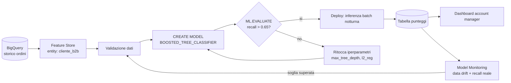
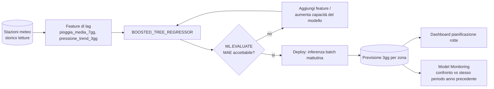
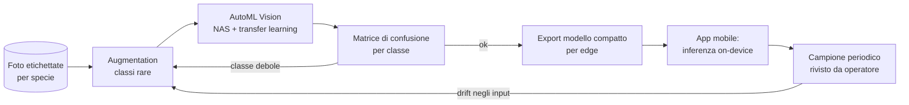
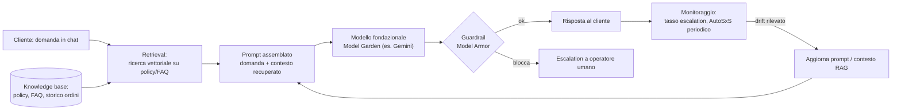

# Certificazione PMLE — Sintesi: architetture end-to-end e MLOps

!!! warning "Questa lezione non è un dominio dell'esame — è una sintesi"
    Le sei lezioni precedenti sono mappate 1:1 sui sei domini ufficiali
    della exam guide, con contenuto verificato parola per parola dove
    possibile. Questa lezione è diversa: è stata aggiunta su richiesta
    esplicita dello studente per **collegare** quella teoria in
    architetture concrete e complete, perché le domande d'esame reali
    sono spesso basate su scenari che attraversano più domini insieme,
    non su un singolo dominio isolato. Non esiste un testo verbatim della
    exam guide da citare per queste quattro architetture: sono sintesi
    didattiche costruite applicando i concetti già visti (e marcati
    `needs_reverification`) nelle lezioni precedenti. Ogni nome di
    prodotto Google Cloud usato qui è già stato verificato nelle lezioni
    di dominio corrispondenti; qui non viene riverificato una seconda
    volta. I diagrammi e il richiamo ai pilastri del Google Cloud
    Architecture Framework sono anch'essi sintesi didattica, non testo
    verbatim di quel framework.

## Quattro architetture, quattro problemi diversi

Non un solo esempio esteso all'infinito, ma quattro problemi realistici
che insieme coprono i tipi di dato, i pattern di serving e le decisioni
più comuni: dati tabellari per una decisione di business interna
(previsione acquisto, batch), serie temporali con feature esterne
(previsione meteo, batch), immagini con un team senza competenze ML
(classificazione fiori con AutoML, edge), e un'applicazione di AI
generativa (assistente clienti con RAG, online) — l'unica delle quattro
in tempo reale, apposta per mostrare un pattern di serving diverso dagli
altri tre. Per ciascuna: dati e feature, scelta del modello, training e
troubleshooting, pipeline, deploy, monitoraggio — le stesse sette
domande che un vero progetto ML deve rispondere in un ordine o
nell'altro.

!!! info "Come leggere i diagrammi: il Google Cloud Architecture Framework"
    Ogni architettura sotto include un diagramma e un breve richiamo a
    quali **pilastri** del Google Cloud Architecture Framework (il
    "Well-Architected Framework" di Google Cloud) la decisione descritta
    sta applicando — non per introdurre nuovi concetti, ma per dare un
    nome esplicito a ragionamenti già fatti nelle lezioni precedenti.
    I cinque pilastri richiamati qui:

    - **Eccellenza operativa**: automatizzare, validare, tracciare invece
      di eseguire a mano (Dominio 5).
    - **Sicurezza, privacy e conformità**: gestione PII, guardrail su
      input/output generativi (Domini 2, 6).
    - **Affidabilità**: rollout controllati, gestione del degrado nel
      tempo (Domini 4, 6).
    - **Ottimizzazione dei costi**: scegliere batch vs online, la scala
      di intervento più economica che basta (Domini 1, 4).
    - **Ottimizzazione delle prestazioni**: scegliere l'hardware e il
      pattern di serving giusti per il carico reale (Domini 3, 4).

    **Stato: needs_reverification** — la struttura a cinque pilastri è
    conoscenza generale pre-addestramento sul framework pubblico di
    Google Cloud, non riverificata su documentazione live in questa
    sessione (bloccato, vedi `course/research_gaps.md`); il framework
    reale potrebbe includere pilastri aggiuntivi (es. sostenibilità) o
    una formulazione leggermente diversa nella sua versione corrente.

## Architettura 1: prevedere se un cliente comprerà ancora (dati tabellari)

**Problema di business.** Nordica Commerce (la stessa azienda delle
lezioni precedenti) vuole dare priorità agli account manager: prevedere
quali clienti business faranno un nuovo ordine nei prossimi 30 giorni,
così il team commerciale contatta prima chi rischia di restare inattivo.

**Principi Well-Architected applicati qui.** Eccellenza operativa: la
pipeline valida e riaddestra da sola, senza intervento manuale a ogni
ciclo. Ottimizzazione dei costi: inferenza batch invece di un endpoint
online sempre acceso, perché nessuno aspetta una risposta immediata.
Affidabilità: il deploy è condizionato al superamento della soglia di
qualità su `ML.EVALUATE`, non automatico a prescindere dal risultato.

**Dati e feature.** Le stesse tabelle BigQuery e lo stesso Feature Store
del Dominio 2, con feature diverse per questo problema specifico:
`giorni_dall_ultimo_ordine`, `spesa_media_ordine_eur`,
`numero_ordini_180gg`, `ticket_aperti_90gg` (riutilizzata dal modello di
rinnovo), e una feature categorica nuova, `settore_industria` (es.
"retail", "manifatturiero", "logistica"). Una feature categorica non può
entrare in un modello come stringa: va codificata. Dentro lo stesso
`TRANSFORM` che già standardizza le feature numeriche (Dominio 1), si
aggiunge `ML.ONE_HOT_ENCODER(settore_industria) AS settore_encoded` —
trasforma ogni categoria in una colonna binaria (0/1), salvata e
riapplicata identica a training e predizione, per lo stesso motivo per
cui `ML.STANDARD_SCALER` lo è.

**Scelta del modello.** Due candidati validi: `LOGISTIC_REG` (semplice,
interpretabile) o `BOOSTED_TREE_CLASSIFIER` (cattura interazioni non
lineari, es. "pochi giorni dall'ultimo ordine **ma** spesa media
storicamente bassa" pesa diversamente da ciascuna delle due condizioni
prese da sola). A differenza del modello di rinnovo contratti del
Dominio 3 — dove l'interpretabilità era un vincolo esplicito perché
bisognava spiegare la decisione al cliente — qui il modello è uno
strumento di prioritizzazione **interno**, nessun cliente vede il
punteggio: l'interpretabilità pesa meno, la capacità di catturare
interazioni pesa di più. Nordica sceglie `BOOSTED_TREE_CLASSIFIER`.

**Training e troubleshooting: overfitting, con numeri veri.** BigQuery
ML espone `ML.TRAINING_INFO` per seguire l'andamento dell'addestramento
per iterazione (numero di alberi aggiunti). Un andamento tipico:

| Iterazione | AUC training | AUC validation |
|---|---|---|
| 10 | 0,79 | 0,78 |
| 50 | 0,89 | 0,80 |
| 100 | 0,95 | 0,81 |

Fino all'iterazione 10 le due curve sono vicine: il modello sta ancora
imparando pattern generali. Da 50 a 100, l'AUC di training continua a
salire ma quella di validation ristagna — il divario che si allarga è la
firma dell'**overfitting**: il modello sta memorizzando dettagli
specifici del training set (rumore, casi particolari) che non
generalizzano a clienti mai visti. Rimedi concreti per un
`BOOSTED_TREE_CLASSIFIER` in BigQuery ML: ridurre `max_tree_depth`
(alberi più piccoli, meno capacità di memorizzare), aumentare `l2_reg`
(penalizza pesi troppo grandi), impostare `subsample` sotto 1.0
(ogni albero vede solo una parte casuale dei dati, riducendo la
correlazione tra alberi), o attivare `early_stop=TRUE` (ferma
l'aggiunta di alberi quando la metrica di validation smette di
migliorare — esattamente l'iterazione 50-60 in questo esempio, non
la 100).

**Pipeline.** Stessa struttura a componenti del Dominio 5 (valida dati →
estrai feature → addestra → valuta → deploy condizionale), con la
soglia di qualità sul **recall** invece che sull'AUC grezzo — coerente
con il ragionamento costo-errore del Dominio 1: perdere un cliente che
stava per riattivarsi (falso negativo) costa più di contattare per
errore un cliente che non comprava comunque (falso positivo). Policy di
retraining: settimanale, o immediato se il recall misurato sulle
predizioni della settimana precedente scende sotto 0,65.

**Deploy.** Il punteggio serve una volta al giorno in una dashboard per
gli account manager, non in tempo reale mentre parlano al telefono con
un cliente specifico (a differenza del Problema 4 del Dominio 1) —
**inferenza batch**, un job notturno che scrive il punteggio aggiornato
per tutti i clienti in una tabella, non un endpoint online.

**Monitoraggio.** Model Monitoring segue la distribuzione di
`giorni_dall_ultimo_ordine` e `spesa_media_ordine_eur` in ingresso (data
drift) e il recall reale una volta che si conoscono gli esiti dei 30
giorni successivi (per decidere se attivare il retraining).

## Architettura 2: prevedere la pioggia per pianificare le consegne (serie temporali con feature esterne)

**Problema di business.** La divisione logistica di Nordica vuole
prevedere la pioggia nei prossimi 3 giorni per zona di consegna, per
ripianificare le rotte in caso di maltempo.

**Principi Well-Architected applicati qui.** Ottimizzazione delle
prestazioni: la scelta tra `ARIMA_PLUS` e `BOOSTED_TREE_REGRESSOR` è
guidata da quale modello usa meglio i driver esterni disponibili, non
dal modello "più potente" in astratto. Affidabilità: il monitoraggio
confronta contro lo stesso periodo dell'anno precedente, non contro il
mese scorso, per non scambiare un ciclo stagionale atteso per un guasto.

**Dati e feature.** Letture storiche di stazioni meteo per zona: pioggia
giornaliera, umidità, pressione atmosferica. Per un problema di
forecasting, le feature più informative spesso non sono i valori del
giorno stesso ma la loro storia recente: `pioggia_ieri`,
`pioggia_media_7gg` (media mobile), `pressione_trend_3gg` (differenza
tra pressione di oggi e di 3 giorni fa, un segnale classico di
perturbazioni in arrivo) — **feature di lag**, costruite esplicitamente,
non fornite già pronte dai dati grezzi.

**Scelta del modello: ARIMA_PLUS o BOOSTED_TREE_REGRESSOR con feature di
lag?** Non è la stessa scelta del Problema 1 del Dominio 1. `ARIMA_PLUS`
modella una serie storica **univariata**: impara da sola stagionalità e
trend di un'unica variabile nel tempo, con pochissima feature
engineering manuale — ottima quando il segnale principale è il pattern
storico della variabile stessa. Ma qui la pioggia dipende fortemente da
umidità e pressione, variabili **esterne** che `ARIMA_PLUS` non
incorpora con la stessa naturalezza. Trasformare il problema in
regressione tabellare con feature di lag e feature esterne, risolta con
`BOOSTED_TREE_REGRESSOR`, permette al modello di usare quelle variabili
esterne insieme alla storia della pioggia stessa — un compromesso comune
nella pratica quando il forecasting ha driver esterni noti, non solo un
pattern storico autosufficiente.

**Training e troubleshooting: underfitting, con numeri veri.** Il primo
tentativo di Nordica usa `LINEAR_REG` con solo due feature
(`pioggia_ieri`, `umidita`):

| | MAE training | MAE validation |
|---|---|---|
| Primo tentativo (LINEAR_REG, 2 feature) | 8,2 mm | 8,4 mm |
| Dopo la correzione (BOOSTED_TREE_REGRESSOR, feature di lag + pressione) | 3,1 mm | 3,4 mm |

Nel primo tentativo, l'errore di training e quello di validation sono
**entrambi alti e vicini tra loro** — la firma opposta dell'overfitting
visto nell'Architettura 1: qui il modello non impara abbastanza né sui
dati che vede né su quelli nuovi. È **underfitting**: un modello lineare
non cattura l'interazione non lineare tra pressione e probabilità di
pioggia, e mancano le feature di lag che portano la maggior parte del
segnale predittivo. La correzione non è "raccogliere più dati" (non
risolverebbe un modello troppo semplice) ma aumentare la capacità del
modello (passare a `BOOSTED_TREE_REGRESSOR`, non lineare) **e**
aggiungere le feature che mancavano — le due correzioni insieme portano
il MAE da 8 mm a 3 mm, con un divario train/validation piccolo e normale.

**Pipeline e deploy.** Job batch ogni mattina, produce la previsione a 3
giorni per zona, alimenta una dashboard di pianificazione rotte — di
nuovo inferenza batch, non serve una risposta in tempo reale.

**Monitoraggio: una sfumatura che gli altri due esempi non hanno.** Con
dati meteo, la distribuzione delle feature cambia **normalmente** con le
stagioni: più pioggia in autunno, meno in estate. Un sistema di
monitoraggio che confronta ciecamente "questa settimana" con "il mese
scorso" segnalerebbe data drift falsamente ogni cambio di stagione. Il
confronto corretto è contro lo **stesso periodo dell'anno precedente**,
non contro il periodo immediatamente prima — distinguere un cambiamento
di distribuzione **atteso e ciclico** da un vero problema (es. una
stazione meteo guasta che manda letture costanti) è parte del progettare
bene il monitoraggio, non solo attivarlo.

## Architettura 3: riconoscere specie di fiori da una foto (immagini, AutoML)

**Problema di business.** Una catena di vivai, "Vivai Bosco Verde",
vuole una funzione nella sua app: il cliente punta il telefono su un
fiore e l'app suggerisce la specie e i consigli di cura. Nessuno in
azienda ha competenze di visione artificiale.

**Principi Well-Architected applicati qui.** Ottimizzazione delle
prestazioni: l'inferenza on-device elimina la latenza di rete per un
caso d'uso che deve rispondere istantaneamente in negozio. Affidabilità:
funziona anche offline, dove un endpoint cloud fallirebbe. Sicurezza e
conformità: nessuna foto del cliente lascia il telefono per
l'inferenza, un vantaggio di privacy secondario ma reale della scelta
edge.

**Dati.** Qualche migliaio di foto etichettate per una ventina di
specie, ma **non equamente distribuite**: rose (800 foto, la specie più
venduta) contro varietà rare di orchidea (40 foto ciascuna) — uno
sbilanciamento realistico quando i dati vengono dalle vendite reali del
negozio, non raccolti apposta per il training.

**Scelta dello strumento.** Stesso ragionamento del Problema 2 del
Dominio 1 (nessuna competenza CV in azienda, dataset di foto etichettate
già pronto) → **AutoML**, con un budget di calcolo impostato dal team.
Il motivo per cui questo funziona anche con solo 40 foto per le
varietà più rare è il **transfer learning** che AutoML usa internamente
(Dominio 1): partendo da un backbone già pre-addestrato su milioni di
immagini generiche, servono molte meno foto per specializzarlo su una
categoria specifica rispetto ad addestrare una rete da zero.

**Valutazione: il problema che l'accuratezza aggregata nasconde.** Il
report di AutoML mostra un'accuratezza complessiva del 90% — sembra
buono. Ma la matrice di confusione **per classe** racconta un'altra
storia:

| Specie | Foto training | Precision | Recall |
|---|---|---|---|
| Rosa | 800 | 0,95 | 0,96 |
| Orchidea rara X | 40 | 0,71 | 0,52 |

Il recall di 0,52 sull'orchidea rara significa che quasi metà delle foto
di quella specie viene classificata come qualcos'altro (spesso una
specie visivamente simile e più rappresentata nel training). L'accuratezza
aggregata del 90% è dominata dalle specie comuni e nasconde
completamente questo problema — la stessa lezione della matrice di
confusione del Dominio 1, qui applicata a un problema multi-classe
invece che binario. Rimedi concreti: raccogliere più foto etichettate
per le specie rare (la correzione più efficace, se possibile);
augmentation dei dati (rotazioni, ritagli, variazioni di colore per
moltiplicare artificialmente i 40 esempi disponibili); oppure, se la
distinzione fine tra varietà simili non è critica per il business,
accorpare specie facilmente confondibili in un'unica etichetta più ampia.

**Deploy: edge o cloud?** L'app deve funzionare mentre il cliente è in
negozio, spesso con connessione debole o assente vicino agli scaffali —
un endpoint cloud (Dominio 4) introdurrebbe latenza e punti di fallimento
in una situazione dove serve una risposta istantanea offline. La scelta
è **edge**: esportare una versione compatta del modello che gira
direttamente sul telefono. Si accetta una precisione leggermente
inferiore al modello cloud completo, in cambio di funzionamento offline
affidabile e zero costo/latenza di rete per richiesta — esattamente il
tipo di trade-off hardware discusso nel Dominio 4, qui applicato a una
decisione di business reale.

**Monitoraggio, un caso diverso dagli altri due.** Qui non arriva
automaticamente un'etichetta "vera" per ogni foto scattata da un
cliente (nessuno conferma "sì, era davvero quella specie"), quindi il
monitoraggio classico basato su accuratezza in produzione non si applica
direttamente. Due alternative pratiche: monitorare la distribuzione
degli **input** (es. un aumento improvviso di foto scure o sfocate può
segnalare un problema di condizioni di scatto, non del modello), e
far rivedere periodicamente un campione di foto da un operatore umano
per stimare l'accuratezza reale sul campo — un controllo a campione,
non continuo, ma comunque sistematico.

## Architettura 4: assistente clienti con RAG (AI generativa, online)

**Problema di business.** Il servizio clienti di Nordica riceve molte
domande ripetitive su policy di reso, tempi di consegna e stato ordini.
Nordica vuole un assistente in chat che risponda subito usando la
documentazione interna (policy, FAQ) e lo storico ordini del cliente
specifico, lasciando agli operatori umani solo i casi che l'assistente
non sa gestire.

**Perché questa è l'unica architettura online delle quattro.** Un
cliente in chat aspetta una risposta in pochi secondi — l'esatto
opposto delle Architetture 1 e 2, dove nessuno aspettava un risultato
immediato. È anche l'unico caso qui in cui il pattern di serving
(**online**, Dominio 4) è imposto dal problema stesso, non da una
scelta di ottimizzazione dei costi.

**Scelta dello strumento: perché non si addestra nulla da zero.** Le
policy di reso e le FAQ cambiano periodicamente. Addestrare o fare
fine-tuning di un modello ogni volta che una policy cambia sarebbe lento
e costoso. La scelta a minimo intervento (Dominio 1, primo livello della
scala di costo) è **prompting con RAG**: recuperare i documenti
pertinenti alla domanda al momento della richiesta e passarli come
contesto al modello fondazionale, così un aggiornamento di policy è un
aggiornamento di documento nella knowledge base, non un nuovo
addestramento.

**Il rischio che non esisteva nelle prime tre architetture.** Un cliente
potrebbe scrivere una domanda costruita per far rivelare all'assistente
dati di un altro cliente, o per fargli ignorare le sue istruzioni
originali (prompt injection, Dominio 6). Il guardrail (es. Model Armor)
controlla l'output prima che raggiunga il cliente e, in caso di dubbio,
smista la conversazione a un operatore umano invece di rispondere — un
tipo di controllo che i primi tre esempi, senza input testuale libero da
un utente esterno, non richiedevano.

**Valutazione e troubleshooting: non esiste un'unica risposta
corretta.** Non c'è un `ML.EVALUATE` con una metrica numerica netta: due
riassunti diversi della stessa policy possono essere entrambi corretti.
Si usa AutoSxS (Dominio 2) per confrontare periodicamente una nuova
versione del prompt o del set di documenti recuperati contro la
versione in produzione, calibrato su un campione giudicato da persone.
Un sintomo specifico di questa architettura, diverso da overfitting e
underfitting: l'assistente risponde con una policy **scaduta**. La causa
tipica non è un problema di "modello" ma di **freschezza dell'indice di
retrieval** — un documento di policy è stato aggiornato ma non
re-indicizzato, quindi il retrieval continua a recuperare la versione
vecchia. È l'equivalente, per un sistema RAG, del training-serving skew
di un modello tradizionale: l'informazione usata in produzione non
corrisponde più a quella corrente.

**Monitoraggio.** Oltre al guardrail sull'input/output, si tracciano il
**tasso di escalation** a un operatore umano (se sale, l'assistente sta
faticando su un tipo di domanda nuovo) e, periodicamente, un nuovo
confronto AutoSxS contro un set di domande di test aggiornato — non
un'unica valutazione una tantum, ma un ciclo ricorrente, più leggero di
un retraining ma comunque continuo.

## Playbook di troubleshooting

Le due architetture sopra hanno mostrato overfitting e underfitting con
numeri concreti; qui la sintesi generale, valida per qualsiasi modello
(BigQuery ML, AutoML, o una rete Keras costruita a mano come nelle
Lezioni 10-13 del corso principale).

| Sintomo | Diagnosi | Cause tipiche | Rimedi |
|---|---|---|---|
| Metrica di training alta, metrica di validation nettamente più bassa, il divario cresce nel tempo | **Overfitting** | Modello troppo capiente per i dati disponibili; troppo poco training data; troppe feature rispetto agli esempi | Più dati; regolarizzazione (L2, dropout — Lezione 12 del corso principale); early stopping; modello più semplice; feature selection |
| Metrica di training e di validation entrambe basse e vicine tra loro, nessuna delle due migliora con più training | **Underfitting** | Modello troppo semplice per il problema; feature insufficienti o poco informative; troppa regolarizzazione | Modello più capiente (es. da lineare ad alberi/rete); aggiungere feature (es. feature di lag per serie temporali); ridurre la regolarizzazione; addestrare più a lungo |
| Metrica di validation **migliore** di quella di training | **Probabile bug nella pipeline**, non un problema di modello | Split train/validation con leakage nella direzione sbagliata; validation set sistematicamente più facile del training set | Controllare come è stato fatto lo split (Lezione 3 del corso principale) prima di toccare il modello |
| Il modello valutato bene in training/validation performa peggio in produzione, con lo stesso codice e gli stessi pesi | **Training-serving skew** | Preprocessing calcolato diversamente in training e serving; feature lette da fonti diverse | Usare `TRANSFORM` in BigQuery ML o un Feature Store condiviso (Domini 1-2) invece di duplicare la logica |
| Accuratezza in produzione stabile per mesi, poi degrada gradualmente | **Data drift o concept drift** (Dominio 6) | Cambia la distribuzione dei dati in ingresso (data drift) o la relazione input-target (concept drift) | Distinguere i due (Dominio 6) prima di scegliere se basta più training data recente o serve rivedere le feature; attenzione ai cambiamenti **stagionali attesi** (Architettura 2), che non sono un vero problema |
| Una pipeline automatica distribuisce comunque un modello addestrato su dati palesemente rotti | **Manca un passo di validazione dati** (Dominio 5) | Nessuna soglia automatica su qualità/range dei dati prima del training | Aggiungere un componente di validazione dati nella pipeline, prima del training |
| Un assistente basato su RAG risponde con informazioni scadute o sbagliate, pur senza aver cambiato il modello (Architettura 4) | **Indice di retrieval non aggiornato** — l'equivalente, per un sistema RAG, del training-serving skew | Un documento sorgente è stato aggiornato ma non re-indicizzato per la ricerca vettoriale | Automatizzare la re-indicizzazione quando i documenti sorgente cambiano; monitorare la freschezza dell'indice, non solo l'output del modello |

## MLOps per ML tradizionale e per AI generativa: cosa cambia davvero

Le sei lezioni di dominio trattano soprattutto ML tradizionale (un
target chiaro, una metrica numerica). Il Dominio 2 introduce l'AI
generativa solo per la parte di valutazione (LLM-as-a-judge). Ecco il
confronto esplicito, punto per punto:

| Aspetto | ML tradizionale | AI generativa (LLMOps) |
|---|---|---|
| Cosa si "addestra" | Un modello nuovo o affinato su dati etichettati (Domini 1, 3) | Spesso nessun addestramento da zero: si sceglie tra prompting/RAG, tuning efficiente in parametri, fine-tuning completo (scala di costo, Dominio 1) |
| Come si valuta | Metriche numeriche con una risposta "corretta" nota: precision/recall/F1/MAE (Domini 1, 6) | Spesso non esiste un'unica risposta corretta: LLM-as-a-judge / AutoSxS con autorater calibrato su giudizio umano (Dominio 2) |
| Cosa si versiona | Dati, codice, pesi del modello (Dominio 2, ML Metadata) | Anche prompt/template ed eventuale contesto RAG, non solo i pesi — un cambio di prompt è una modifica di "comportamento" tanto quanto un retraining |
| Quando si "riaddestra" | Policy basata su soglia di degrado delle metriche o volume di nuovi dati (Dominio 5) | Spesso più economico e frequente: aggiornare prompt/contesto RAG prima di considerare un nuovo tuning; il tuning stesso segue comunque la stessa policy basata su soglie |
| Cosa si monitora in produzione | Training-serving skew, data/concept/feature attribution drift (Dominio 6) | Tutto quanto sopra **più** rischi specifici: prompt injection, fughe di dati sensibili, tossicità/bias negli output, tramite strumenti come Model Armor (Dominio 6) |
| Pipeline CI/CD/CT | Il "CT" riaddestra il modello quando la policy lo richiede (Dominio 5) | Il corrispondente è spesso un ciclo di valutazione continua (nuovi prompt di test, nuovo confronto SxS) più che un retraining pesante |

Il filo comune: entrambi i mondi seguono lo stesso ciclo — validare,
addestrare/adattare, valutare, distribuire con un rollout controllato,
monitorare — cambia **cosa** si aggiorna e **come** si misura "ha
funzionato", non la struttura del ciclo stesso.

## Errori comuni

- Copiare l'architettura di un problema su un altro senza rivalutare i
  vincoli: `ARIMA_PLUS` andava bene per la domanda di prodotto
  (Dominio 1) ma non è la scelta giusta per un forecasting con forti
  driver esterni come la pioggia (Architettura 2).
- Guardare solo l'accuratezza aggregata su un problema multi-classe
  sbilanciato: nasconde esattamente le classi che contano di più
  (Architettura 3).
- Reagire a un aumento dell'errore di produzione riaddestrando subito,
  senza prima controllare se è drift atteso e stagionale o un vero
  cambiamento (Architettura 2).
- Trattare "AI generativa" come "la stessa cosa del ML tradizionale ma
  con un modello diverso": cambiano la valutazione, il versionamento e
  cosa si monitora, non solo il tipo di modello.
- Scegliere inferenza online per un problema che è in realtà batch (le
  Architetture 1 e 2 sono entrambe batch: nessuno aspetta una risposta
  immediata), pagando latenza e costo inutili.
- In un sistema RAG (Architettura 4), aggiornare i documenti sorgente
  senza re-indicizzarli per il retrieval: il modello continua a ricevere
  come contesto la versione vecchia, anche se la policy è già cambiata.

## Quiz

1. Nordica ha due modelli da costruire: uno che deve spiegare al cliente
   perché un contratto non è stato rinnovato (Dominio 3), uno che deve
   solo dare priorità interna agli account manager (Architettura 1 qui).
   Perché la stessa scelta di `model_type` non è ovvia per entrambi?
2. Un modello di forecasting meteo ha MAE di training 8 mm e MAE di
   validation 8,4 mm — vicini ma entrambi alti. Overfitting o
   underfitting, e perché "raccogliere più dati" da solo non basterebbe
   a risolverlo?
3. Un classificatore di immagini multi-classe ha il 90% di accuratezza
   aggregata. Perché questo numero da solo non basta a dire che il
   modello è pronto per la produzione?
4. Perché il concetto di "retraining" nel ML tradizionale non si applica
   allo stesso modo a un'applicazione basata su un modello fondazionale
   con prompting/RAG?
5. Nell'Architettura 4, l'assistente clienti risponde citando una policy
   di reso che è già stata modificata due settimane fa. Il modello non è
   stato toccato. Qual è la causa più probabile, e a quale problema
   dell'ML tradizionale è concettualmente simile?

<b>Apri le risposte</b>

1. Perché i due problemi hanno vincoli diversi anche se la forma dei dati
   è simile: il modello per il cliente ha un vincolo di **interpretabilità**
   esplicito (Dominio 3) — un cliente deve poter capire la decisione, il
   che favorisce `LOGISTIC_REG` o alberi semplici. Il modello di
   prioritizzazione interna non ha questo vincolo, quindi può usare
   `BOOSTED_TREE_CLASSIFIER` per catturare più interazioni non lineari
   anche a scapito dell'interpretabilità.
2. È **underfitting**: entrambe le metriche sono alte e vicine, segno che
   il modello non sta catturando il pattern nemmeno sui dati che vede.
   Più dati aiuterebbero solo se il problema fosse che il modello non ha
   visto abbastanza esempi di un pattern che è comunque in grado di
   rappresentare — qui il problema è che il modello (troppo semplice, o
   con feature insufficienti) non ha la capacità di rappresentare quel
   pattern, quindi serve aumentare la capacità del modello e/o le feature,
   non solo il volume di dati.
3. Perché l'accuratezza aggregata è dominata dalle classi più numerose:
   un modello può avere recall molto basso su una classe rara (importante
   per il business) restando comunque al 90% di accuratezza complessiva,
   grazie alle classi comuni. Serve guardare la matrice di confusione per
   classe, non solo l'aggregato.
4. Perché non c'è necessariamente un nuovo addestramento da fare: si può
   migliorare il comportamento aggiornando il prompt o il contesto
   recuperato da RAG, senza toccare i pesi del modello — un ciclo di
   iterazione più economico e più frequente di un retraining tradizionale,
   che invece richiede sempre nuovi dati etichettati e un nuovo
   addestramento.
5. La causa più probabile è che il documento di policy sia stato
   aggiornato ma non re-indicizzato per il retrieval: il sistema continua
   a recuperare e passare al modello la versione vecchia come contesto.
   È concettualmente simile al **training-serving skew** del ML
   tradizionale: l'informazione usata "in produzione" (qui, il contesto
   recuperato) non corrisponde più a quella corrente, anche se il resto
   del sistema (il modello, il codice) non è cambiato.

## Fonti

- Google Cloud, *Professional Machine Learning Engineer Certification exam
  guide* (fonte primaria per la terminologia e i concetti di dominio
  riutilizzati qui; le quattro architetture stesse non sono contenuto
  verbatim della guida — vedi il riquadro in cima alla pagina):
  https://services.google.com/fh/files/misc/professional_machine_learning_engineer_exam_guide_english.pdf
- Google Cloud, *Professional Machine Learning Engineer Certification*
  (pagina ufficiale, contesto generale sull'esame):
  https://cloud.google.com/learn/certification/machine-learning-engineer
- Lezioni pmle-01..06 di questo stesso modulo, per il dettaglio verificato
  di ciascun concetto riutilizzato qui. Il richiamo ai cinque pilastri del
  Google Cloud Architecture Framework è conoscenza generale
  pre-addestramento, non riverificata su documentazione live in questa
  sessione — vedi `course/research_gaps.md`.
